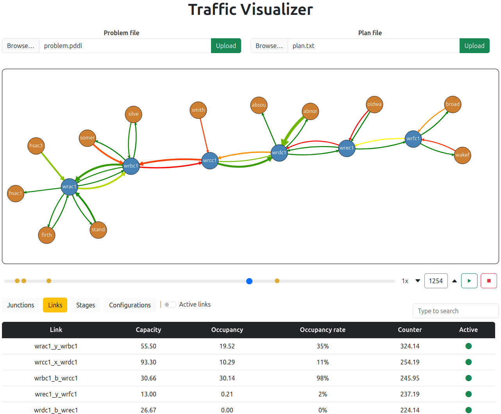

# Traffic Visualizer

Web-based interface implementing a traffic visualisation and exploration system.



## Installation
Run `npm install` in the root of the repository.

## Usage

1. Start the development server:
```
    npm run dev
```

2. Open the printed local URL in your browser (usually http://localhost:5173/).

3. In the interface, load the two input files:
    - **Problem file** (see `example/problem.pddl`)
    - **Plan file** (see `example/plan_simulation.txt`), generated with [PPS](https://github.com/hstairs/pps)